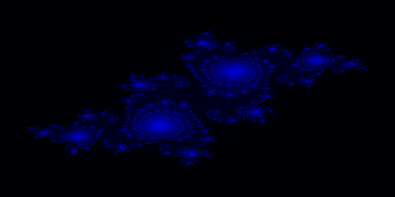

# Programación funcional

En este repo, se colocan algúnas tareas o proyectos, que realice por parte de la asignatura de programación funcional la cual curse en la maestría. Se utilizo el lenguaje Haskell y se abordaron diferentes estructuras de datos, algoritmos de busqueda e una idea general de como funciona este paradigma.

## Fractales usando programación funcional
Otro de los trabajos abordados fue el realizar diferentes fractales usando progamación funcional. De igual manera se aneja un pdf mostrando el funcionamiento del código.
Los fractales realizados, fueron los famosos conjuntos de Mandelbrot y Julia.

## Grafos desde un punto de vista funcional
Entre los trabajos elaborados en esta asignatura uno fue dedicado a la implementación de grafos desde un punto de vista funcional. Se adjunta un pdf en el cual se explica parte de esta implementación.
